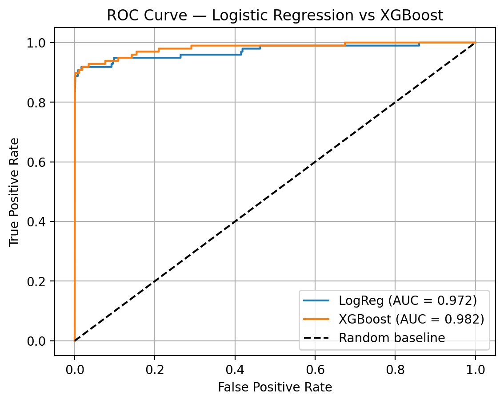
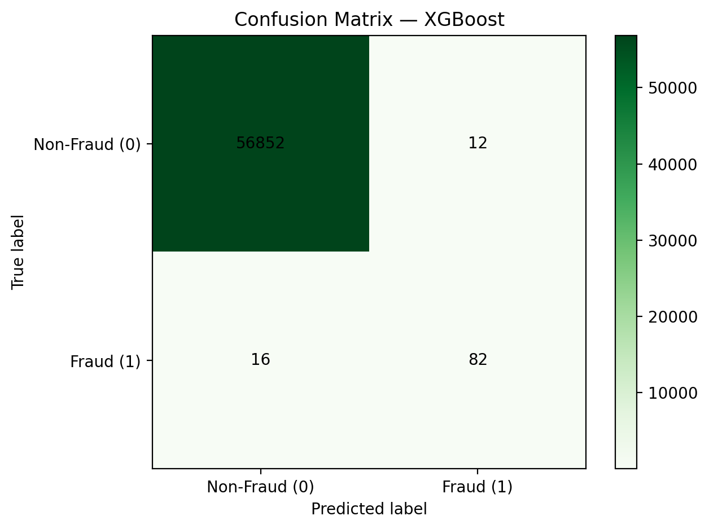

# classic-ml-fraud-detection
# 🛡️ Credit Card Fraud Detection

End-to-End Applied Machine Learning Project

# 🛡️ Credit Card Fraud Detection  
**End-to-End Applied Machine Learning Project**

📌 Project Overview

Credit card fraud costs financial institutions billions of dollars annually.
This project builds and evaluates machine learning models to detect fraudulent transactions while balancing false positives (blocking real customers) and false negatives (missing fraud).

The goal is not only to achieve strong predictive performance, but to demonstrate an applied data science workflow from data ingestion → modeling → evaluation → interpretation.

🎯 Business Problem

Financial institutions must:

Detect fraud as early as possible

Minimize disruption to legitimate customers

Handle extreme class imbalance (fraud ≪ non-fraud)

This project answers:

Can we reliably identify fraudulent transactions while maintaining an acceptable customer experience?

📊 Dataset

Source: Public credit card transaction dataset

Size: ~280,000 transactions

Target variable: Class

0 → Legitimate transaction

1 → Fraudulent transaction

Key challenge: Fraud represents <1% of all transactions

All features are numerical and anonymized for privacy.

🔍 Exploratory Data Analysis (EDA)

Key findings:

Severe class imbalance requires careful evaluation metrics

Standard accuracy is misleading for this problem

Precision, Recall, F1-Score, and ROC-AUC are more meaningful

EDA steps include:

Class distribution analysis

Feature scaling

Train/validation split with stratification

🧠 Modeling Approach
Baseline Model: Logistic Regression

Serves as a transparent, interpretable baseline

Helps establish a performance floor

Suitable for regulated financial environments

Advanced Model: XGBoost

Handles non-linear feature interactions

More robust to complex decision boundaries

Often used in real-world fraud systems

Both models were trained using:

Proper train/test splits

Feature scaling where required

Class imbalance-aware evaluation

📈 Model Evaluation
Metrics Used

Because of class imbalance, we prioritize:

Recall (Fraud class) → catching fraud

Precision → minimizing false alerts

ROC-AUC → overall ranking performance

Results Summary (Example)
Model	ROC-AUC	Recall (Fraud)	Precision
Logistic Regression	Strong baseline	Moderate	High
XGBoost	Improved	Higher	Competitive

XGBoost achieved higher fraud recall while maintaining reasonable precision, making it more suitable for production use.

🔎 Interpretation & Business Insights
Key Trade-offs

Increasing fraud recall reduces missed fraud

But may increase false positives → customer friction

Business Recommendation

XGBoost is preferred when fraud loss outweighs customer inconvenience

Logistic Regression may be chosen where interpretability is required

Threshold tuning allows institutions to customize risk tolerance based on business priorities.

🧪 Project Structure
classic-ml-fraud-detection/
│
├── data/                 # Raw and processed datasets
├── notebooks/            # EDA and modeling notebooks
├── src/                  # Reusable preprocessing & modeling code
├── models/               # Saved model artifacts
├── assets/               # Visualizations and figures
└── README.md             # Project documentation

🛠️ Tech Stack

Python

Pandas / NumPy

Scikit-Learn

XGBoost

Matplotlib / Seaborn

Jupyter Notebook

🚀 Future Improvements

Threshold optimization based on business cost functions

SHAP values for advanced model interpretability

Real-time inference simulation

Model monitoring & drift detection

📌 Key Takeaway

This project demonstrates how applied data science goes beyond model accuracy — balancing business constraints, risk, and interpretability to deliver real-world value.

👤 Author

Juante Wilson
Aspiring Applied Data Scientist / Machine Learning Engineer
GitHub: https://github.com/Juantew

## 📌 Project Overview
Credit card fraud costs financial institutions billions of dollars annually.  
This project builds and evaluates machine learning models to detect fraudulent transactions while balancing **false positives** (blocking real customers) and **false negatives** (missing fraud).


The goal is not only strong predictive performance, but to demonstrate a complete **applied data science workflow** from  
**data ingestion → modeling → evaluation → interpretation**.

---

## 🎯 Business Problem
Financial institutions must:
- Detect fraud as early as possible
- Minimize disruption to legitimate customers
- Handle **extreme class imbalance** (fraud ≪ non-fraud)

This project answers the question:

**Can we reliably identify fraudulent transactions while maintaining an acceptable customer experience?**

---

## 📊 Dataset
- **Source:** Public Credit Card Fraud Detection dataset (European cardholders)
- **Size:** ~280,000 transactions
- **Target Variable:** `Class`  
  - `0` → Legitimate transaction  
  - `1` → Fraudulent transaction
- **Key Challenge:** Fraud represents **< 1%** of all transactions

All features are numerical and anonymized for privacy.

---

## 🔍 Exploratory Data Analysis (EDA)

### Key Findings
- Severe class imbalance makes accuracy misleading
- Precision, Recall, F1-Score, and ROC-AUC are more appropriate metrics
- Feature scaling is required for some models

### EDA Steps
- Class distribution analysis
- Feature scaling
- Stratified train / test split

---

## 🧠 Modeling Approach

### Baseline Model — Logistic Regression
- Transparent and interpretable
- Establishes a performance baseline
- Suitable for regulated financial environments

### Advanced Model — XGBoost
- Captures non-linear feature interactions
- Handles complex decision boundaries
- Commonly used in real-world fraud systems

Both models were trained using:
- Proper train/test splits
- Feature scaling where required
- Class-imbalance-aware evaluation metrics

---

## 📈 Model Evaluation

### Metrics Used
Due to extreme class imbalance, evaluation focused on:
- **Recall (Fraud Class):** catching fraudulent transactions
- **Precision:** minimizing false alerts
- **ROC-AUC:** overall ranking performance

---

### Results Summary (Test Set)

| Model | ROC-AUC | Recall (Fraud) | Precision |
|------|--------|----------------|-----------|
| Logistic Regression | *(fill)* | *(fill)* | *(fill)* |
| XGBoost | *(fill)* | *(fill)* | *(fill)* |

---

### ROC Curve


**ROC Curve – Fraud Detection Performance**

This ROC curve illustrates the trade-off between true positive rate and false positive rate across classification thresholds.  
XGBoost achieves a higher ROC-AUC than Logistic Regression, indicating superior ranking ability for distinguishing fraudulent from legitimate transactions under extreme class imbalance.

---

### Confusion Matrix


**Confusion Matrix – Fraud Class Focus**

The confusion matrix highlights the model’s ability to correctly identify fraudulent transactions while minimizing false positives.  
This visualization makes the business trade-off explicit: increasing fraud recall improves loss prevention but may increase customer friction.

---

## 🔎 Interpretation & Business Insights

### Key Trade-offs
- Increasing fraud recall reduces missed fraud
- Higher recall may increase false positives, impacting customer experience

### Business Recommendation
- **XGBoost** is preferred when fraud loss outweighs customer inconvenience
- **Logistic Regression** may be favored where interpretability and regulatory transparency are required
- Decision thresholds can be tuned to align with business risk tolerance

---

## 🧪 Project Structure
```text
classic-ml-fraud-detection/
│
├── data/                 # Raw and processed datasets
├── notebooks/            # EDA and modeling notebooks
├── src/                  # Reusable preprocessing & modeling code
├── models/               # Saved model artifacts
├── assets/               # Evaluation plots and figures
└── README.md             # Project documentation
```

---

🛠️ Tech Stack

Python

Pandas / NumPy

Scikit-Learn

XGBoost

Matplotlib / Seaborn

Jupyter Notebook
---

🚀 Future Improvements

Threshold optimization using business cost functions

SHAP values for advanced interpretability

Real-time inference simulation

Model monitoring and drift detection
---

📌 Key Takeaway

This project demonstrates how applied data science goes beyond model accuracy — balancing business constraints, risk, and interpretability to deliver real-world value.
---


👤 Author

Juante Wilson
Aspiring Applied Data Scientist / Machine Learning Engineer
GitHub: https://github.com/Juantew


    
